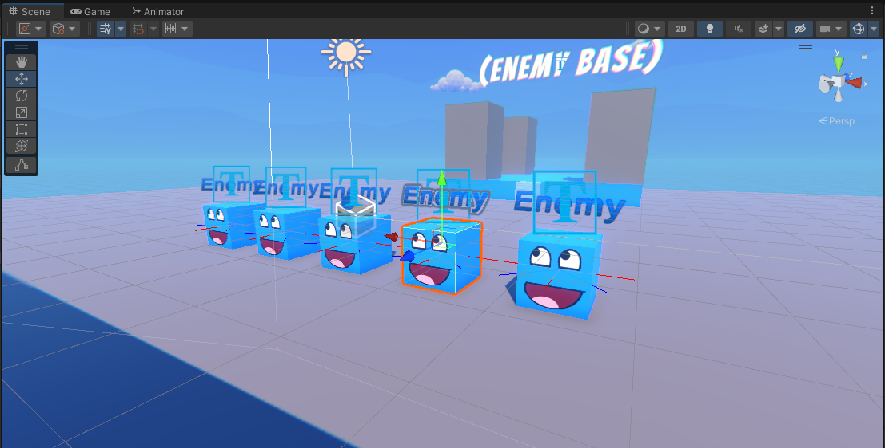

# *Upgrade!* (3D Tower Defense Game)

## About this project

### *Upgrade!* is a fun little project that I decided to start working on to showcase my skills and knowledge inside of the Unity game engine. I've never worked on a tower defense game before but it helps to know about lots of different engine features.
- If you want to view my C# scripts click [here](https://github.com/KleemoffDeveloper/Upgrade-Game-Scripting).

---

## Description

### Launch explosive balls at enemy cubes that are trying to attack your castle. The explosive balls deal a certain amount of area damage and knockback (depending on stats of selected ball). At the end of each defense round, you can <b>upgrade</b> your castle. The more you <b>upgrade</b>, the higher your rank becomes and you gain access to new items.

- Platforms: itch.io

- Operating Systems: WebGL, Windows, MacOS

---
## Development Photo 1 ([EnemyBehavior.cs](https://github.com/KleemoffDeveloper/Upgrade-Game-Scripting/blob/master/AI/EnemyBehavior.cs))
